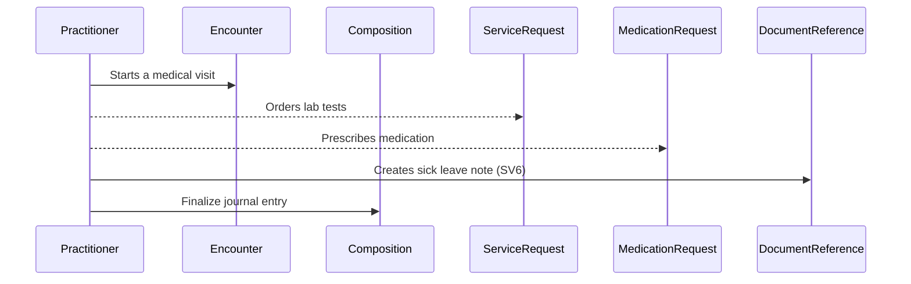

<!DOCTYPE html>
<html lang="en">
<body>

<h1>FHIR Composition as the Main Structured Resource</h1>

<h2>Structure Overview</h2>

This FHIR transaction Bundle organizes structured journal data while preserving the original free-text document in Base64. It ensures FHIR compliance, easy querying, and legal preservation.

<h2>📌 Journal Entry Sections</h2>
<ul>
    <li><strong>Käyntirivi</strong> (Visit summary: date, place, author, and author's title)</li>
    <li><strong>Esitiedot</strong> (Patient history)</li>
    <li><strong>Nykytila</strong> (Current state)</li>
    <li><strong>Diagnoosi</strong> (Diagnosis with ICD-10 code)</li>
    <li><strong>Suunnitelma</strong> (Plan/treatment)</li>
</ul>

<h2>🔗 Linked Resources</h2>
<ul>
    <li>Patient</li>
    <li>Encounter</li>
    <li>Practitioner (Author)</li>
    <li>Condition</li>
    <li>DocumentReference (optional)</li>
</ul>

<h2>📝 Sample FHIR Bundle</h2>

<pre><code>{
  "resourceType": "Bundle",
  "type": "transaction",
  "entry": [
    {
      "resource": {
        "resourceType": "Encounter",
        "id": "encounter-1",
        "status": "finished",
        "class": {
          "system": "http://terminology.hl7.org/CodeSystem/v3-ActCode",
          "code": "AMB",
          "display": "Ambulatory"
        },
        "subject": { "reference": "Patient/patient-1" },
        "participant": [
          {
            "individual": {
              "reference": "Practitioner/doctor-1",
              "display": "Tohtori Kirjaaja, Yleislääkäri"
            }
          }
        ],
        "location": [
          {
            "location": {
              "reference": "Location/terveyskeskus",
              "display": "Terveyskeskus Helsinki"
            }
          }
        ],
        "period": {
          "start": "2024-03-15T09:00:00+02:00",
          "end": "2024-03-15T09:30:00+02:00"
        }
      }
    },
    {
      "resource": {
        "resourceType": "Composition",
        "id": "composition-1",
        "status": "final",
        "type": {
          "coding": [
            {
              "system": "1.2.246.537.6.12.2002.119",
              "code": "11506-3",
              "display": "Hoitokertomus"
            }
          ]
        },
        "subject": { "reference": "Patient/patient-1" },
        "date": "2024-03-15",
        "author": [{ "reference": "Practitioner/doctor-1" }],
        "encounter": { "reference": "Encounter/encounter-1" },
        "section": [
          {
            "title": "Käyntirivi",
            "text": {
              "status": "generated",
              "div": "
<b>Päivämäärä:</b> 2024-03-15 <b>Paikka:</b> Terveyskeskus Helsinki <b>Kirjaaja:</b> Tohtori Kirjaaja <b>Kirjaajan titteli:</b> Yleislääkäri
"
            }
          },
          {
            "title": "Esitiedot",
            "text": {
              "status": "generated",
              "div": "
Potilas valittelee olevansa kipiä
"
            }
          },
          {
            "title": "Nykytila",
            "text": {
              "status": "generated",
              "div": "
Sanoo Aaa, kurkku punottaa
"
            }
          },
          {
            "title": "Diagnoosi",
            "entry": [{ "reference": "Condition/condition-1" }]
          },
          {
            "title": "Suunnitelma",
            "text": {
              "status": "generated",
              "div": "
Loppuviikko saikkua. Buranaa tarvittaessa.
"
            }
          },
          {
            "title": "Original Document",
            "entry": [{ "reference": "DocumentReference/docref-1" }]
          }
        ]
      }
    },
    {
      "resource": {
        "resourceType": "Condition",
        "id": "condition-1",
        "clinicalStatus": {
          "coding": [
            {
              "system": "http://terminology.hl7.org/CodeSystem/condition-clinical",
              "code": "active",
              "display": "Active"
            }
          ]
        },
        "code": {
          "coding": [
            {
              "system": "http://hl7.org/fhir/sid/icd-10",
              "code": "X0.0",
              "display": "Angiina"
            }
          ],
          "text": "Angiina"
        },
        "subject": { "reference": "Patient/patient-1" },
        "encounter": { "reference": "Encounter/encounter-1" },
        "recordedDate": "2024-03-15"
      }
    },
    {
      "resource": {
        "resourceType": "DocumentReference",
        "id": "docref-1",
        "status": "current",
        "type": {
          "coding": [
            {
              "system": "1.2.246.537.6.12.2002.119",
              "code": "11506-3",
              "display": "Hoitokertomus"
            }
          ]
        },
        "subject": { "reference": "Patient/patient-1" },
        "date": "2024-03-15",
        "author": [{ "reference": "Practitioner/doctor-1" }],
        "context": {
          "encounter": [{ "reference": "Encounter/encounter-1" }]
        },
        "content": [
          {
            "attachment": {
              "contentType": "text/plain",
              "data": "UG90aWxhcyB2YWxpdHRlbGVlIG9sZXZhbnNhIGtpcGlhCgpOeWt5dGlsYTpTYW5vbyBBYWEsIGt1cmtrdSBwdW5vdHRhYQpEaWFnbm9vc2k6IFgwLjAgQW5naWluYQpTdXVubml0ZWxtYTogTG9wcHV1aWtrbyBzYWlra3VhLiBCdXJhbmFhIHRhcnZpdHRhZXNzYQ=="
            }
          }
        ]
      }
    }
  ]
}</code></pre>
<h1>Clinical Note Sequence Diagram</h1>

<h1>Lab Order Service Request</h1>

This paragraph provides an implementation of a FHIR-compliant lab order <code>ServiceRequest</code> for Finnish healthcare systems.

<h2>🔹 Features</h2>
<ul>
    <li>Uses the <strong>Finnish laboratory test classification</strong> (Kuntaliitto - Laboratoriotutkimusnimikkeistö).</li>
    <li>FHIR <code>ServiceRequest</code> resource for ordering lab tests.</li>
    <li>Supports bundling multiple tests in a single request.</li>
</ul>

<h2>📌 Usage</h2>

To request a lab order, create a <code>ServiceRequest</code> resource in FHIR JSON format.

<h2>📝 Example ServiceRequest</h2>

<pre><code>{
  "resourceType": "ServiceRequest",
  "id": "sr-all-lab-tests",
  "status": "active",
  "intent": "order",
  "code": {
    "coding": [
      {
        "system": "urn:oid:1.2.246.537.6.98",
        "code": "6428",
        "display": "S -Kolesteroli"
      },
      {
        "system": "urn:oid:1.2.246.537.6.98",
        "code": "6430",
        "display": "S -Kolesteroli, high density lipoproteiinit"
      },
      {
        "system": "urn:oid:1.2.246.537.6.98",
        "code": "6432",
        "display": "S -Kolesteroli, low density lipoproteiinit, analysoitu"
      },
      {
        "system": "urn:oid:1.2.246.537.6.98",
        "code": "6427",
        "display": "S -Triglyseridit"
      },
      {
        "system": "urn:oid:1.2.246.537.6.98",
        "code": "1026",
        "display": "S -Alaniiniaminotransferaasi"
      },
      {
        "system": "urn:oid:1.2.246.537.6.98",
        "code": "6354",
        "display": "Pt-Glomerulussuodosnopeus, estimoitu, CKD-EPI-tutkimuksen kaava"
      },
      {
        "system": "urn:oid:1.2.246.537.6.98",
        "code": "1489",
        "display": "S -Glutamyylitransferaasi"
      }
    ]
  },
  "subject": {
    "reference": "Patient/321"
  },
  "requester": {
    "reference": "Practitioner/123"
  },
  "authoredOn": "2022-05-09T11:55:00Z"
}</code></pre>

<h2>📚 Resources</h2>
<ul>
    <li><a href="https://www.hl7.org/fhir/servicerequest.html" target="_blank">FHIR ServiceRequest Documentation</a></li>
    <li><a href="https://build.fhir.org/ig/hl7-eu/laboratory/StructureDefinition-ServiceRequest-eu-lab.html">European FHIR ServiceRequest Documentation</a></li>
    <li><a href="https://koodistopalvelu.kanta.fi/codeserver/pages/classification-list-page.xhtml?clearUserCachedLists=true" target="_blank">
        Finnish Laboratory Test Codes (Koodistopalvelu)
    </a></li>
</ul>

<h1>📄 Finnish Sick Leave Note (Lääkärintodistus A - SV6)</h1>

<h2>🎯 Purpose</h2>

The Lääkärintodistus A (SV6) is a medical document used for:

<ul>
    <li>Applying sickness allowance from Kela.</li>
    <li>Informing employers about work incapacity.</li>
    <li>Assessing rehabilitation plans.</li>
</ul>

<h2>📑 FHIR Data</h2>

The following FHIR DocumentReference example structure is used:

<pre><code>{
  "resourceType": "DocumentReference",
  "id": "sairausloma-2025-001",
  "status": "current",
  "type": {
    "coding": [
      {
        "system": "urn:oid:1.2.246.537.6.12.2002.141",
        "code": "SV6",
        "display": "Lääkärintodistus A (SV6)"
      }
    ]
  },
  "subject": {
    "reference": "Patient/00000002",
    "display": "Pasi Potilas"
  },
  "author": [
    {
      "reference": "Practitioner/456",
      "display": "Dr. Testaaja"
    }
  ],
  "date": "2025-03-19T00:00:00Z",
  "content": [
    {
      "attachment": {
        "contentType": "application/pdf",
        "url": "https://example.com/fhir/DocumentReference/sairausloma-2025-001.pdf",
        "title": "Lääkärintodistus A (SV6) - Sairausloma"
      }
    }
  ],
  "context": {
    "encounter": {
      "reference": "Encounter/789"
    },
    "related": [
      {
        "reference": "Condition/321",
        "display": "Ulkomuotoon ja käyttäytymiseen liittyvät oireet ja sairaudenmerkit (R46)"
      },
      {
        "reference": "Condition/322",
        "display": "Merkittävin työkykyä alentava sairaus, vamma tai elimen luovutus"
      }
    ],
    "period": {
      "start": "2025-03-19",
      "end": "2025-04-18"
    }
  },
  "category": [
    {
      "coding": [
        {
          "system": "http://hl7.org/fhir/ValueSet/doc-typecodes",
          "code": "clinical-note",
          "display": "Clinical Note"
        }
      ]
    }
  ],
  "custodian": {
    "reference": "Organization/567",
    "display": "Yritys Oy"
  },
  "securityLabel": [
    {
      "coding": [
        {
          "system": "http://terminology.hl7.org/CodeSystem/v3-Confidentiality",
          "code": "R",
          "display": "Restricted"
        }
      ]
    }
  ]
}</code></pre>

More info: <a href="https://www.kela.fi">Kela’s official website</a>.

<h2>💊 MedicationRequest</h2>

An example of a FHIR-compliant <code>MedicationRequest</code> can be found at: <a href="https://github.com/fhir-fi/finnish-base-profiles" target="_blank">Finnish Base Profiles Repository</a>.

<h2>📝 License</h2>

MIT License - Free to use and modify.

</body>
</html>
